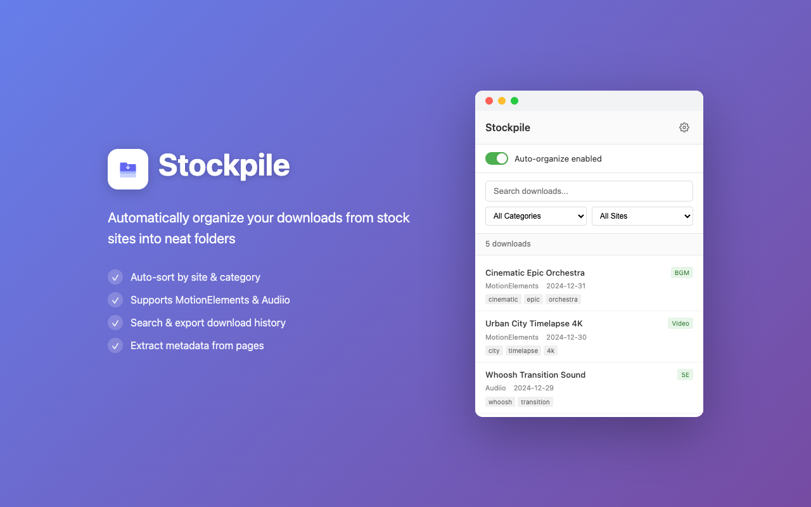
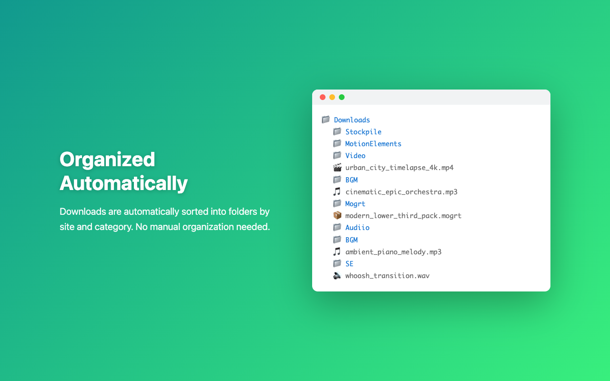

# Stockpile - Download Organizer

MotionElements や Audiio などのストックサイトからダウンロードしたアセットを自動的に整理する Chrome 拡張機能です。

## スクリーンショット





## 機能

- **自動フォルダ振り分け**: ダウンロードしたファイルをサイト・カテゴリ別に自動で整理
- **メタデータ抽出**: ページからタイトル、タグ、カテゴリ、長さなどの情報を自動取得
- **ダウンロード履歴**: 過去のダウンロードを検索・フィルタリング可能
- **エクスポート機能**: JSON/CSV 形式でダウンロード履歴をエクスポート

## 対応サイト

| サイト | カテゴリ |
|--------|----------|
| MotionElements | Video, BGM, SE, Mogrt, Preset, AE_Template, LUT, Photo |
| Audiio | BGM, SE |

## フォルダ構造

ダウンロードしたファイルは以下の構造で保存されます:

```
Downloads/
└── Stockpile/
    ├── MotionElements/
    │   ├── Video/
    │   ├── BGM/
    │   ├── SE/
    │   ├── Mogrt/
    │   ├── Preset/
    │   └── AE_Template/
    └── Audiio/
        ├── BGM/
        └── SE/
```

## インストール

1. このリポジトリをクローンまたはダウンロード
2. Chrome で `chrome://extensions` を開く
3. 右上の「デベロッパーモード」を有効化
4. 「パッケージ化されていない拡張機能を読み込む」をクリック
5. このフォルダを選択

## 使い方

1. 拡張機能アイコンをクリックしてポップアップを開く
2. トグルスイッチで自動整理の有効/無効を切り替え
3. 対応サイトでファイルをダウンロードすると自動的に振り分けられる
4. ポップアップから過去のダウンロードを検索・確認可能

## 設定

拡張機能のオプションページから以下の設定が可能:

- **ベースフォルダ名**: デフォルトは `Stockpile`
- **サイト別の有効/無効**: 各サイトの自動整理を個別に設定
- **カテゴリマッピング**: サイトのカテゴリをフォルダ名にマッピング

## ファイル構成

```
stockpile-extension/
├── manifest.json          # 拡張機能マニフェスト
├── background/
│   └── service-worker.js  # バックグラウンド処理
├── content/
│   ├── motionelements.js  # MotionElements 用コンテンツスクリプト
│   └── audiio.js          # Audiio 用コンテンツスクリプト
├── lib/
│   ├── storage.js         # 設定管理
│   └── database.js        # ダウンロード履歴管理
├── popup/
│   ├── popup.html         # ポップアップ UI
│   ├── popup.css          # スタイル
│   └── popup.js           # ポップアップロジック
└── options/
    ├── options.html       # 設定ページ
    └── options.js         # 設定ロジック
```

## 必要な権限

- `downloads`: ダウンロードのファイル名変更
- `storage`: 設定と履歴の保存
- `activeTab`: アクティブタブの情報取得

## ライセンス

MIT
