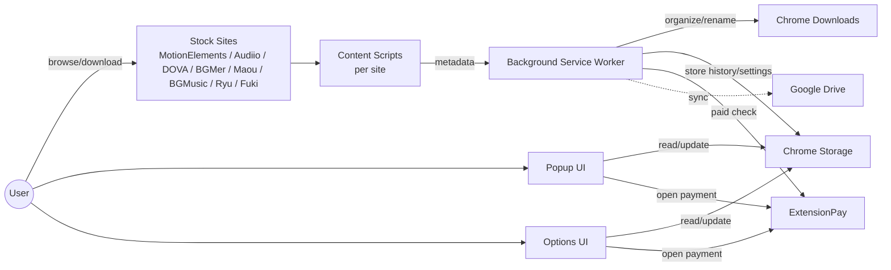
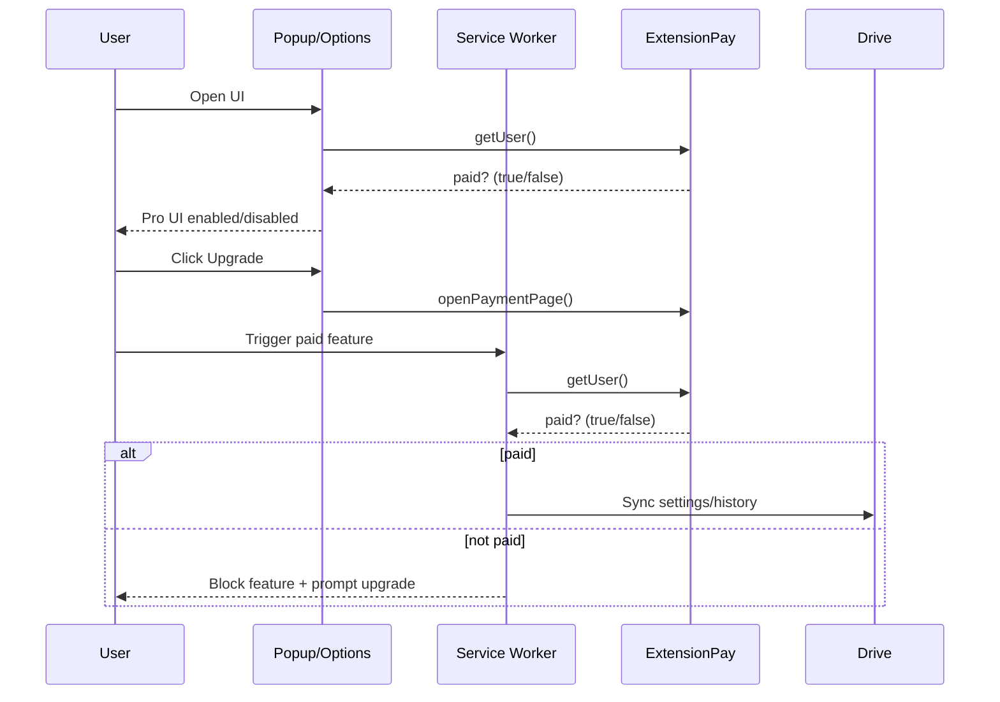

# Architecture Overview

## Component Diagram

```mermaid
flowchart LR
  User((User))
  Sites[Stock Sites<br/>MotionElements / Audiio / DOVA / BGMer / Maou / BGMusic / Ryu / Fuki]
  Content[Content Scripts<br/>per site]
  SW[Background Service Worker]
  Storage[Chrome Storage]
  Downloads[Chrome Downloads]
  Popup[Popup UI]
  Options[Options UI]
  ExtPay[ExtensionPay]
  Drive[Google Drive]

  User -->|browse/download| Sites
  Sites --> Content
  Content -->|metadata| SW
  SW -->|organize/rename| Downloads
  SW -->|store history/settings| Storage
  Popup -->|read/update| Storage
  Options -->|read/update| Storage
  Popup -->|open payment| ExtPay
  Options -->|open payment| ExtPay
  SW -->|paid check| ExtPay
  SW -.->|sync| Drive
  User --> Popup
  User --> Options
```

## Data Flow (Paid Gating)

```mermaid
sequenceDiagram
  participant U as User
  participant P as Popup/Options
  participant SW as Service Worker
  participant EP as ExtensionPay
  participant DR as Drive

  U->>P: Open UI
  P->>EP: getUser()
  EP-->>P: paid? (true/false)
  P-->>U: Pro UI enabled/disabled
  U->>P: Click Upgrade
  P->>EP: openPaymentPage()

  U->>SW: Trigger paid feature
  SW->>EP: getUser()
  EP-->>SW: paid? (true/false)
  alt paid
    SW->>DR: Sync settings/history
  else not paid
    SW-->>U: Block feature + prompt upgrade
  end
```
